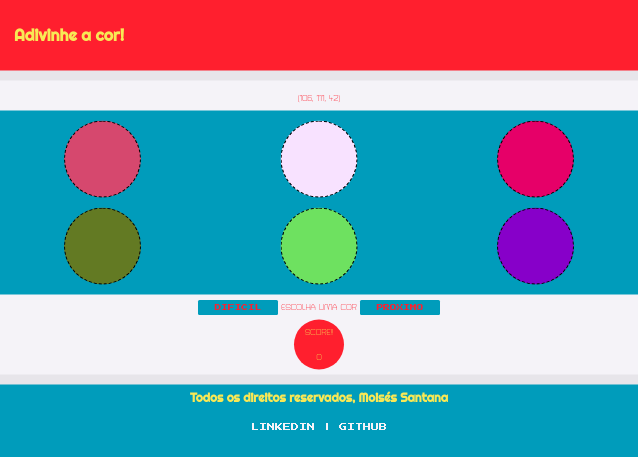

# Projeto Color Guess

Color Guess é um projeto idealizado pela Trybe onde temos como tarefa criar uma página web usando HTML5/CSS3/JavaScript, a página é um jogo onde devemos adivinhar qual cor representa o código RGB, acertando você ganha 3 pontos errando você perde 1, é possível escolher entre 2 difículdades que irá aumentar a quantidade de cores, quando quiser passar para o próximo código RGB, basta clicar no botão "proximo" e irá alterar também as opções como possíveis respostas.

O site foi projetado para um display de 1366 x 768!

## Técnologias utilizadas:

* HTML5
* CSS3
* JavaScript

### Você pode se divertir jogando color-guess com o link abaixo:

https://moisessantana.github.io/color-guess/
